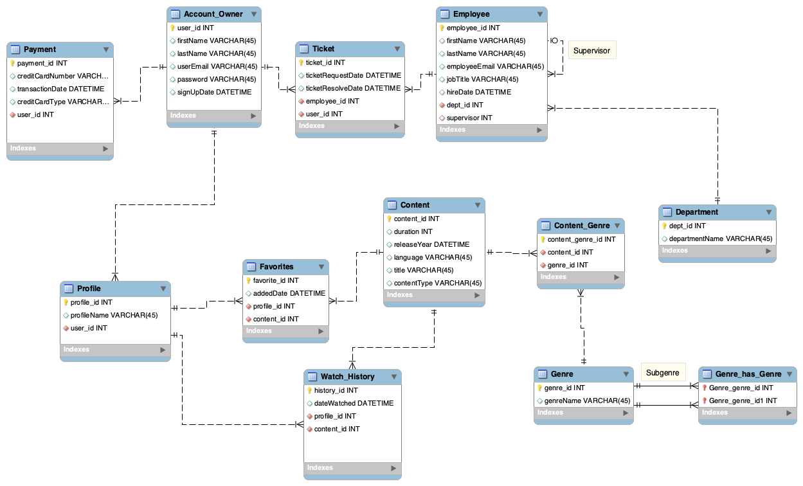

# Fall-2025-Group-3

## Team Name:
62755 Group 3

## Team Members:
1. Ghasan Awad
2. Isaac Lee
3. Marissa Le
4. Matthew Wise
5. Trisha Kattoju

## Problem Description:
This project focuses on developing a relational database that represents the operations of a digital streaming platform. The system is designed to manage subscriber accounts, user profiles, subscription plans, payments, and available content. Each subscriber can maintain multiple profiles under one account, allowing for personalized viewing, rating, and recommendation features. The database also tracks interactions between users and media, such as watch history, favorites, and content reviews. In addition to user activity, the model incorporates employee and department data to handle administrative tasks, customer support, and service maintenance through ticket tracking. Entities are structured with both straightforward and recursive relationships to accurately reflect real-world dependencies within the platform. By generating realistic sample data and performing analytical queries, this model enables a deeper understanding of user behavior, financial performance, and overall system efficiency within the streaming service.

## Data Model
Our model is centered on the Account Owner, the entity that represents the primary user who holds the account. This Account Owner entity serves as the root for two main branches: user activity and billing. For billing, the Account_Owner has a one-to-many relationship with the Payment table, which keeps a historical log of all transactions made by that user. The second branch, user activity, leads to the Profile table. An account owner can create multiple profiles for their account, which is why we established a one-to-many relationship between Account Owner and Profile.

There are two key branches that come from the Profile table. First, the Watch History table logs every video a profile plays. Since one profile can watch many videos over time, this is a one-to-many relationship.

The Favorites table is the second entity that is connected with the profile table. A profile can add many content items to their personal "My List," and a single content item like a popular movie can be favorited by many different profiles. Because of this many-to-many relationship, the Favorites table serves as an associative entity that links the Profile and Content tables.

The Content entity represents our entire media catalog of movies and series. It stores descriptive data like the title, release year, and duration of a show or movie. To organize this large catalog, we have a Genre table, which defines all possible categories. A single movie can be in multiple genres (like action and science-fiction), and a single genre may apply to many movies. To model this many-to-many relationship, we created the Content Genre associative table, which links the content id to the genre id. The Genre table branches out to a join table called Genre_has_Genre with a Subgenre relationship,  allowing a genre like 'Psychological Thriller' to be linked to its parent, 'Thriller'.
Finally, our model involves the internal operations of the company. The Department entity represents our internal teams such as billing and customer support. Inside each department, there are many employees, which is represented by the one-to-many relationship between the Department and Employees tables. The Employees table also has a recursive supervisor relationship to show who reports to whom.

When a customer has a problem, they need to contact an employee. An account owner can have many support tickets, and an Employee (like a support agent) can work on many tickets. This many-to-many relationship is handled by the Ticket associative table, which links the account owner who has a problem to the Employee assigned to help them.

## Data Dictionary:

## Queries:

## Database Information:
Name of the database: ns_Group3
